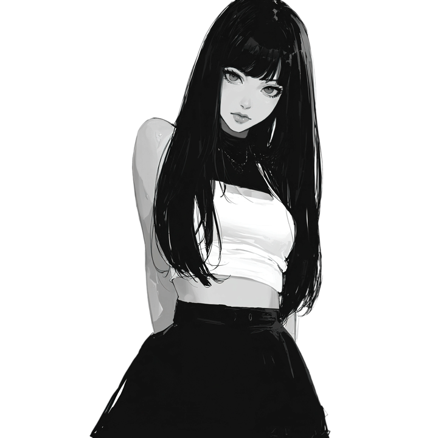

  

  

<h2 align="center">On a journey to build useful things, learn deeply, and become better every day...</h2>

 

<table>
  <tr>
    <td width="64%" valign="top">
      <h2>Salem</h2>
      

        im <strong>kunsulu</strong>
      

      

        Technology fascinates me because it can turn a small idea into something that helps real people. My current focus is <strong>jospaar-ai</strong>, an iOS planner that turns messy thoughts into tasks, events, habits, and reminders.
      

      

        I love working on practical projects, clean interfaces, and small experiments that teach me something new. I am still early in the journey, but I care about steady progress and shipping real work.
      

      
I am very passionate about:

      <ul>
        <li>iOS development, SwiftUI, and product design</li>
        <li>AI assistants and productivity tools</li>
        <li>Learning systems, creative coding, and visual explanations</li>
      </ul>
    </td>
    <td width="36%" align="center" valign="middle">
      
    </td>
  </tr>
</table>

---

## Present Status

<table>
  <tr>
    <td width="66%" valign="top">
      
Learning <strong>Swift, SwiftUI, app architecture, and clean UI flows</strong>

      
Building <strong>jospaar-ai</strong> as a real iOS product, not only a practice repo

      
Improving GitHub habits: readable commits, useful READMEs, and small public progress

      
Practicing Python, web basics, and visual explanation tools like Manim

      
<code>Current mission</code>: learn fast, build honestly, polish the details.

    </td>
    <td width="34%" align="center" valign="middle">
      
    </td>
  </tr>
</table>

---

## Toolbox

  
  
  
  
  
  
  
  
  
  

---

## Featured Work

<table>
  <tr>
    <td width="50%">
      <h3>jospaar-ai</h3>
      
AI-powered iOS planner that turns brain dumps into tasks, events, habits, and reminders.

      <a href="https://github.com/kyacicin/jospaar-ai">Open repository</a>
    </td>
    <td width="50%">
      <h3>Learning Labs</h3>
      
Small projects for Swift, web basics, algorithms, and visual explanations.

      <a href="https://github.com/kyacicin?tab=repositories">Browse repositories</a>
    </td>
  </tr>
</table>

---

## GitHub Stats

  
  

  

